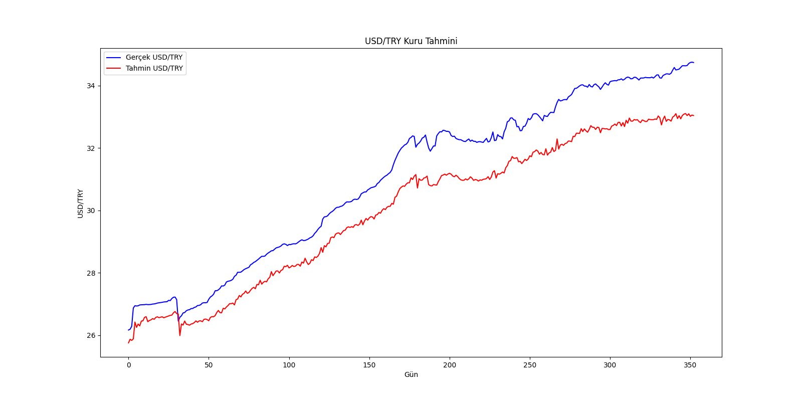

# LSTM Example

This is an example of a LSTM model using the Keras library. The model is trained with the data from the file `data.csv` and then it is used to predict the next value in the sequence.



## Create a virtual environment
```bash
python3 -m venv venv
```

## Activate the virtual environment
```bash
source venv/bin/activate
```

## Install dependencies
```bash
pip install -r requirements.txt
```

## Run the service
```bash
python __main__.py
```

## Deactivate the virtual environment
```bash
deactivate
```